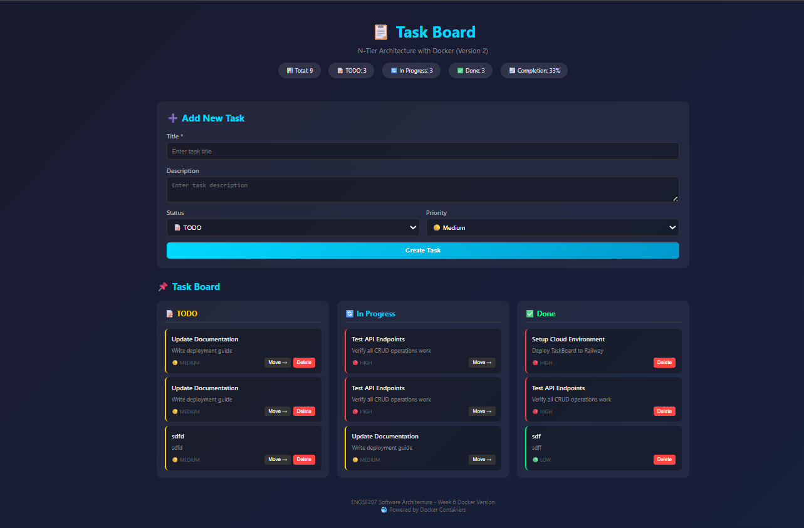
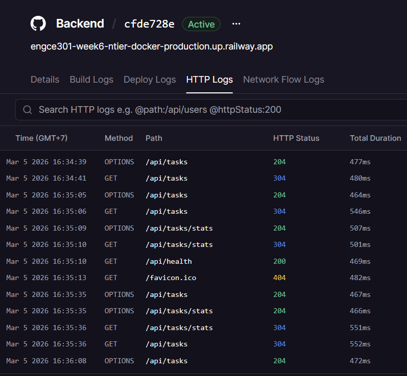
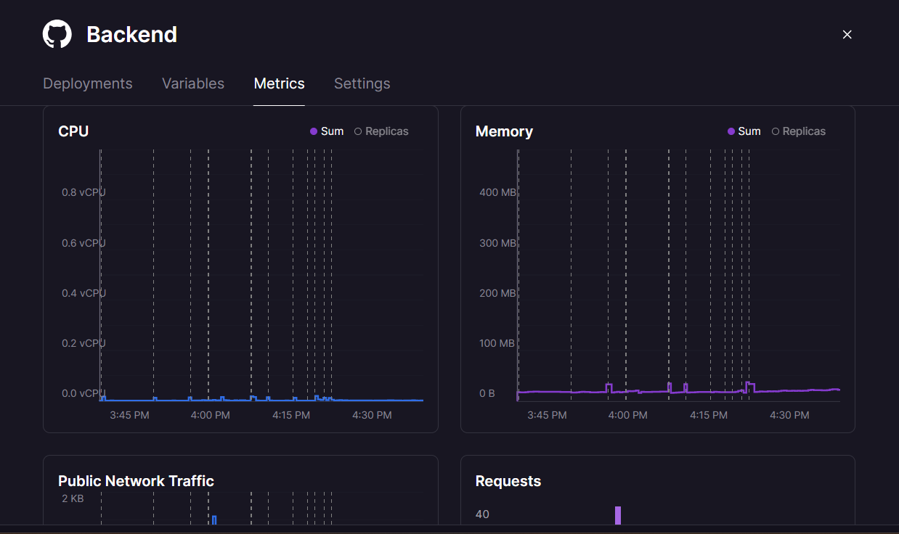

# Cloud Deployment Analysis
## ENGCE301 - Week 7 Lab

**ชื่อ-นามสกุล:** ณัฐกิตติ์ ยั่งยืนปิยรัตน์  
**รหัสนักศึกษา:** 66543206014-3

---

# ส่วนที่ 1: ข้อมูล Deployment

## 1.1 URLs ของระบบที่ Deploy

| Service | URL |
|------|-----|
| Frontend | https://attractive-spirit-production-e8e6.up.railway.app |
| Backend API | https://engce301-week6-ntier-docker-production.up.railway.app |
| Database | (Internal - ไม่มี public URL) |

---

## 1.2 Screenshot หลักฐาน

1. ✓ Railway Dashboard แสดง 3 Services  
2. ✓ Frontend ทำงานบน Browser  
3. ✓ API Health check response  
4. ✓ Logs แสดง requests  
5. ✓ Metrics แสดง CPU/Memory  

---

# ส่วนที่ 2: เปรียบเทียบ Docker vs Cloud

## 2.1 ความแตกต่างที่สังเกตเห็น

| ด้าน | Docker (Week 6) | Railway (Week 7) |
|------|----------------|----------------|
| เวลา Deploy | Deploy ด้วย docker compose ใช้เวลาหลายนาที | Deploy ผ่าน GitHub อัตโนมัติ ใช้เวลาประมาณ 1-2 นาที |
| การตั้งค่า Network | ใช้ Docker Network เชื่อม container | Railway จัดการ network ให้อัตโนมัติ |
| การจัดการ ENV | ใช้ไฟล์ `.env` | ใช้ Variables ใน Railway Dashboard |
| การดู Logs | ดูผ่าน `docker logs` หรือ terminal | ดูผ่าน Railway Dashboard |
| การ Scale | ต้องเพิ่ม container เอง | Railway สามารถ scale service ได้ |

---

## 2.2 ข้อดี/ข้อเสีย ของแต่ละแบบ

### Docker Local

**ข้อดี:**
- ควบคุม environment ได้ทั้งหมด
- สามารถพัฒนาและทดสอบได้ในเครื่อง
- ไม่ต้องใช้ internet

**ข้อเสีย:**
- ไม่สามารถเข้าถึงจาก internet ได้
- ต้องตั้งค่าเองทั้งหมด
- การ deploy ทำได้เฉพาะเครื่อง local

---

### Railway Cloud

**ข้อดี:**
- Deploy ได้ง่ายผ่าน GitHub
- สามารถเข้าถึงผ่าน internet
- มี dashboard สำหรับ logs และ metrics

**ข้อเสีย:**
- ต้องใช้อินเทอร์เน็ต
- บาง features มีข้อจำกัดใน free plan
- ควบคุม infrastructure ได้น้อยกว่า Docker

---

# ส่วนที่ 3: Cloud Service Models

## 3.1 Railway เป็น Service Model แบบไหน?

[x] PaaS

เพราะ: Railway เป็น Platform as a Service ที่ให้ผู้ใช้ deploy application ได้โดยไม่ต้องจัดการ infrastructure เช่น server, network หรือ OS เอง ระบบจะจัดการ environment ให้โดยอัตโนมัติ

---

## 3.2 ถ้าใช้ IaaS (เช่น AWS EC2) ต้องทำอะไรเพิ่มอีก?

1. ติดตั้ง Operating System บน server  
2. ติดตั้ง Docker / Node.js / Database เอง  
3. ตั้งค่า Network และ Firewall  
4. จัดการ Security และ Server maintenance  

---

# ส่วนที่ 4: 12-Factor App Analysis

## 4.1 Factors ที่เห็นจาก Lab

| Factor | เห็นจากไหน? | ทำไมสำคัญ? |
|------|-------------|------------|
| Factor 3: Config | Variables tab | แยก configuration ออกจาก code |
| Factor 5: Build, Release, Run | Railway Deploy pipeline | แยกขั้นตอน build และ run |
| Factor 6: Processes | Railway service container | ทำให้ระบบสามารถ scale ได้ |
| Factor 7: Port Binding | Railway กำหนด PORT ให้ app | ทำให้ service สามารถ expose ผ่าน web |
| Factor 11: Logs | Railway Logs tab | สามารถตรวจสอบปัญหาของระบบได้ง่าย |

---

## 4.2 ถ้าไม่ทำตาม 12-Factor จะมีปัญหาอะไร?

**ปัญหา 1:** ถ้าไม่ทำตาม Factor 3 (Config)

- สิ่งที่จะเกิด: configuration เช่น database URL ถูก hardcode ใน code ทำให้ย้าย environment หรือ deploy ใหม่ได้ยาก

---

**ปัญหา 2:** ถ้าไม่ทำตาม Factor 11 (Logs)

- สิ่งที่จะเกิด: เมื่อระบบเกิด error จะไม่สามารถตรวจสอบหรือ debug ปัญหาได้ง่าย

---

# ส่วนที่ 5: Reflection

## 5.1 สิ่งที่เรียนรู้จาก Lab นี้

1. เรียนรู้การ deploy application ไปยัง Cloud ด้วย Railway  
2. เข้าใจการใช้ Docker และ Cloud ในการ deploy ระบบแบบ N-Tier  
3. เข้าใจการจัดการ environment variables และการทำงานของ cloud platform  

---

## 5.2 ความท้าทาย/ปัญหาที่พบ และวิธีแก้ไข

**ปัญหา:**  
Frontend ไม่สามารถเรียก Backend API ได้ เนื่องจากเกิดปัญหา CORS

**วิธีแก้:**  
แก้ไขการตั้งค่า CORS ใน Express server และตั้งค่า origin ให้รองรับ domain ของ Railway

---

## 5.3 จะเลือกใช้ Docker หรือ Cloud เมื่อไหร่?

**ใช้ Docker เมื่อ:**  
ต้องการพัฒนาและทดสอบระบบในเครื่อง local หรือใช้ใน environment ที่ควบคุมได้เอง

**ใช้ Cloud (PaaS) เมื่อ:**  
ต้องการ deploy ระบบให้ผู้ใช้งานสามารถเข้าถึงผ่าน internet และต้องการให้ระบบ scale ได้ง่าย

# 📸 Screenshots

## Railway Dashboard

## Frontend Application

## API Health Check

## Logs

## Metrics

